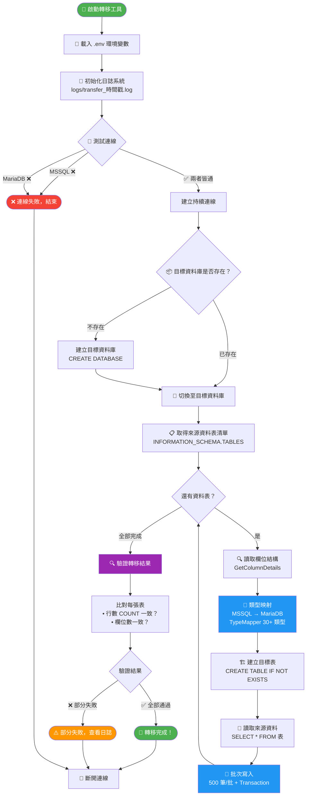

# 資料庫轉移專案 (MSSQL → MariaDB)

> 使用 C# 實現的資料庫轉移工具，用於學習 C# 開發和 Clean Code 實踐

## 📋 專案目標

1. ✅ 建立 MSSQL 測試資料庫（已完成）
2. ✅ 使用 C# 重寫資料庫轉移程式
3. ✅ 實踐 Clean Code 和設計模式
4. ✅ 測試轉移功能

## 🔄 系統流程



## 🗂️ 專案結構

```
DB_Transfer/
├── .env                           # 環境變數配置（敏感資訊，已忽略）
├── .env.example                   # 環境變數範本
├── .gitignore                     # Git 忽略規則
├── README.md                      # 專案說明
├── DBTransfer.slnx                # .NET Solution 檔案
├── logs/                          # 轉移日誌（自動產生，已忽略）
├── scripts/                       # 腳本
│   ├── setup_database.py         # 資料庫建立腳本（舊版）
│   ├── test_remote_connection_ssh.py  # SSH 隧道連接測試（舊版）
│   ├── tunnel.sh                 # SSH 隧道管理腳本 ⭐
│   └── transform_original.py     # 原始 Python 轉移程式（參考）
├── src/                           # C# 原始碼
│   ├── DBTransfer.Core/          # 核心層（介面、模型、服務）
│   │   ├── Interfaces/           # IDatabaseConnector 介面
│   │   ├── Logging/              # ITransferLogger 日誌介面與實作
│   │   ├── Models/               # ColumnInfo, TransferResult 等模型
│   │   ├── Services/             # DatabaseTransferService 轉移服務
│   │   └── Utils/                # TypeMapper, TableNameConverter
│   ├── DBTransfer.Infrastructure/ # 基礎設施層（資料庫連接器）
│   │   └── Database/             # MsSqlConnector, MariaDbConnector
│   └── DBTransfer.Console/       # 主控台入口點（Program.cs）
└── tests/                         # 測試腳本
    ├── test_MSSQL_connection.py  # MSSQL 連接測試 ⭐
    └── test_mariadb_connection.py # MariaDB 連接測試 ⭐
```

⭐ 表示使用 `.env` 環境變數配置的新腳本

## 🚀 快速開始

### 環境要求

- **Python**: 3.11+ (Conda 環境: `db_transfer`)
- **ODBC Driver**: Microsoft ODBC Driver 18 for SQL Server
- **.NET**: 10.0+
- **套件**: Microsoft.Data.SqlClient, MySqlConnector, DotNetEnv
- **資料庫**:
  - 源: MSSQL Server 2022 (AdventureWorks2022)
  - 目標: MariaDB (待建立)

### 初始設置

#### 1. 配置環境變數

```bash
# 複製環境變數範本
cp .env.example .env

# 編輯 .env 填入實際的連接資訊
nano .env  # 或使用其他編輯器
```

環境變數說明請參考 [.env.example](.env.example)

#### 2. 安裝依賴套件

```bash
# 啟動 conda 環境
conda activate db_transfer

# 安裝 Python 套件
pip install pyodbc pymysql python-dotenv
```

### 遠端連接設置

由於防火牆限制，需要透過 SSH 隧道連接到遠端資料庫。

#### 方法 1：使用管理腳本（推薦）✨

```bash
# 啟動 SSH 隧道（同時轉發 MSSQL 和 MariaDB）
./scripts/tunnel.sh start

# 檢查隧道狀態
./scripts/tunnel.sh status

# 停止隧道
./scripts/tunnel.sh stop

# 重啟隧道
./scripts/tunnel.sh restart
```

#### 方法 2：手動建立隧道

```bash
# 一條命令同時轉發兩個端口
ssh -f -N -L 1433:localhost:1433 -L 3306:localhost:3306 yan@140.116.96.67

# 檢查隧道狀態
ps aux | grep "ssh.*yan@140.116.96.67"
lsof -i :1433
lsof -i :3306

# 停止隧道
pkill -f "ssh.*yan@140.116.96.67"
```

### 測試連接

```bash
# 測試 MSSQL 連接
python tests/test_MSSQL_connection.py

# 測試 MariaDB 連接
python tests/test_mariadb_connection.py
```

### 連接資訊

| 項目 | 來源 | 說明 |
|------|------|------|
| **遠端伺服器** | `.env` 檔案 | 從 REMOTE_HOST 讀取 |
| **MSSQL 資料庫** | `.env` 檔案 | AdventureWorks2022 (71 tables, 20 views) |
| **MariaDB 目標** | `.env` 檔案 | 待建立 |
| **連接方式** | SSH 隧道 | 同時轉發端口 1433 和 3306 |

⚠️ **安全提醒**: `.env` 文件包含敏感資訊，已在 `.gitignore` 中設置，不會提交到 Git

## 📚 學習路線

### 當前進度

- [x] 階段一：環境準備與 MSSQL 資料庫建立 ✅
- [x] 階段二：C# 專案架構設計 ✅
- [x] 階段三：C# 核心功能開發 ✅
- [x] 階段四：Clean Code 實踐 ✅
- [ ] 階段五：測試與驗證（需連接實際資料庫）
- [ ] 階段六：文檔與部署

## 🔧 開發工具

- **IDE**: Visual Studio 2022 Community (待安裝)
- **版本控制**: Git
- **Python 環境**: Conda (db_transfer)
- **資料庫管理**:
  - MSSQL: Azure Data Studio
  - MariaDB: HeidiSQL / DBeaver

## 🛠️ 常用命令

### SSH 隧道管理（推薦使用腳本）

```bash
# 使用管理腳本
./scripts/tunnel.sh start      # 啟動 SSH 隧道
./scripts/tunnel.sh status     # 檢查隧道狀態
./scripts/tunnel.sh restart    # 重啟隧道
./scripts/tunnel.sh stop       # 停止隧道
./scripts/tunnel.sh help       # 顯示幫助

# 手動管理（不推薦）
ssh -f -N -L 1433:localhost:1433 -L 3306:localhost:3306 yan@140.116.96.67  # 啟動
ps aux | grep "ssh.*yan@140.116.96.67"   # 檢查狀態
pkill -f "ssh.*yan@140.116.96.67"        # 停止
```

### Python 環境

```bash
# Conda 環境管理
conda activate db_transfer            # 啟動環境
conda deactivate                      # 退出環境
conda env list                        # 列出所有環境

# 套件安裝
pip install pyodbc pymysql python-dotenv

# 測試連接
python tests/test_MSSQL_connection.py     # 測試 MSSQL
python tests/test_mariadb_connection.py   # 測試 MariaDB
```

### 環境設定

```bash
# 初始化環境變數
cp .env.example .env              # 複製範本
nano .env                         # 編輯配置

# 檢查端口狀態
lsof -i :1433                     # MSSQL 端口
lsof -i :3306                     # MariaDB 端口
```

## 📝 注意事項

- SSH 隧道必須保持開啟才能存取遠端資料庫
- 一條 SSH 命令同時轉發 MSSQL (1433) 和 MariaDB (3306) 端口
- 透過 `.env` 文件管理所有連接資訊，不再硬編碼密碼
- 測試腳本會自動檢查環境變數是否正確設置